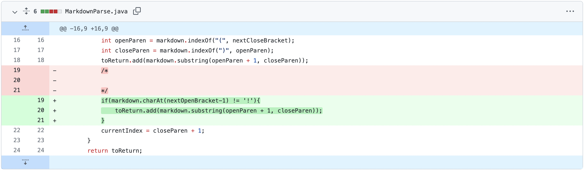
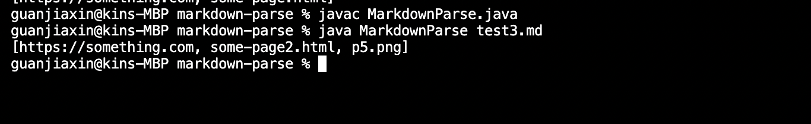
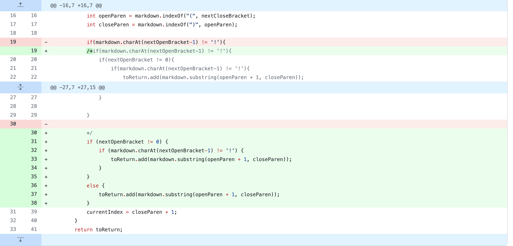
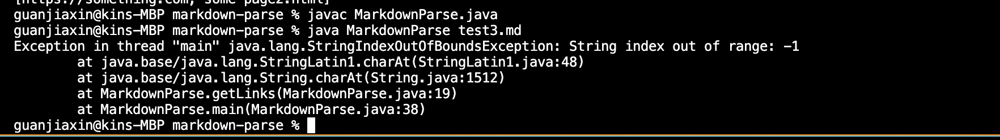
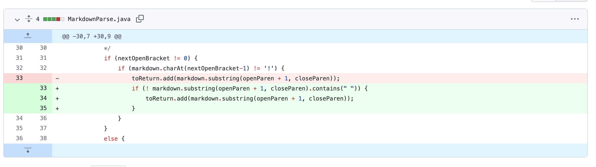
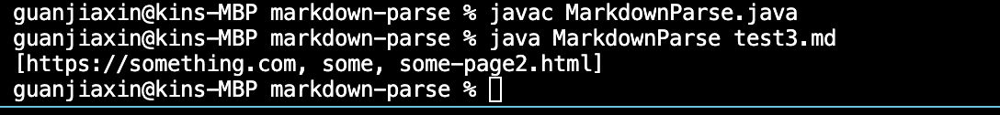

** First Change**

code change:

The failure inducing input which prompts to make this change is: [link](https://github.com/clemialgm/markdown-parse/blob/main/test3.md)

output of this failure:

The original MarkdownParse works well, but it works for some image files as well. However, it is not expected to return the link of the image. This is changed by whether there is a "!" at the start of the file through an if statement.

**Second change**

code change:

The failure inducing input which prompts to make this change is: [link](https://github.com/clemialgm/markdown-parse/commit/8a3b7f864ad9c9cc75dc34b090e1021d9424d706#diff-c30dbff4e529133282d848da192ac83e5d6f1c7593c0e31db0e4104f43178d3e)

output of the failure:

The code after the first change successfully removes the image, but when we delete the headings, there are new problems. 

An out of boundary exception will occur when there is a link in the first line of the Markdown file, because the index is 0 while the loop is checking index smaller than -1.

**Third change**

code change:

the input: [link](https://github.com/clemialgm/markdown-parse/commit/ae45e60603545b7346888cf6517c76e3d6ba3931#diff-c30dbff4e529133282d848da192ac83e5d6f1c7593c0e31db0e4104f43178d3e)

output of the terminal

this time all the errrors are fixed and the terminal works well.
